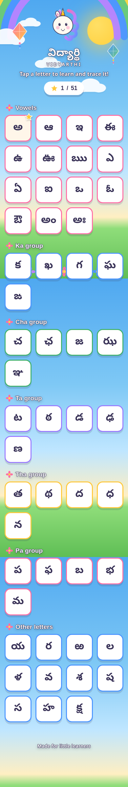
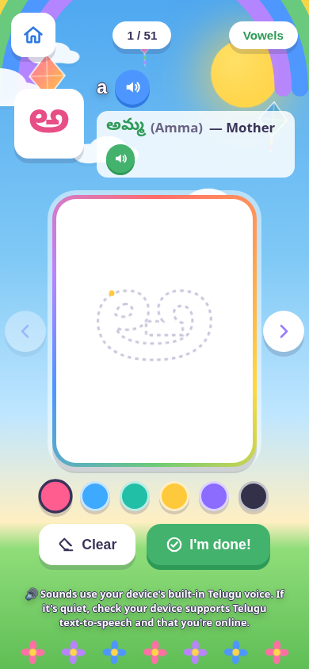
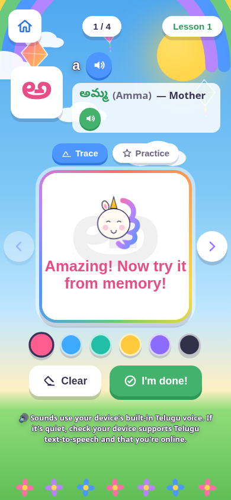
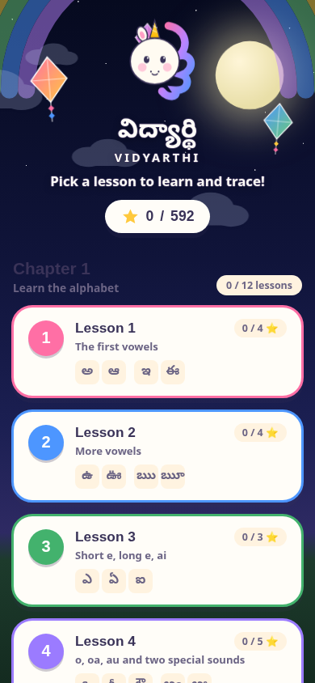

# Vidyarthi — విద్యార్థి ✍️

A friendly, kid-first web app for practicing how to **write Telugu letters** —
on iPad, iPhone, Android phones/tablets, or any touch-screen laptop.

Kids move through the alphabet in the traditional teaching order (vowels,
then consonants), listen to how each letter sounds, see a simple picture
word for it, and **trace a dotted outline** of the letter with a finger,
stylus, or mouse before drawing it freehand — all set in a sky full of
drifting kites and clouds, a rainbow over a flower meadow, and a cheering
unicorn mascot. At night (system dark mode) the very same sky turns into a
star-studded night with a soft moonbow — no toggle needed, it just follows
the device's theme.

See [`PROMPT.md`](PROMPT.md) for the full design/engineering brief this app
was built from.

## ✨ Features

- **52 letters in the traditional sequence**: అ ఆ ఇ ఈ ఉ ఊ ఋ ౠ ఎ ఏ ఐ ఒ ఓ ఔ అం
  అః, then క ఖ గ ఘ ఙ ... in their classic groupings, ending with య ర ల వ శ ష
  స హ ళ క్ష ఱ. Short/long vowel pairs and triples (అ+ఆ, ఇ+ఈ, ఉ+ఊ, ఋ+ౠ,
  ఎ+ఏ+ఐ, ఒ+ఓ+ఔ, అం+అః) are visually kept together wherever the letters are
  shown, since that's how they're taught.
- **Lessons, grouped into collapsible Chapters**: **Chapter 1** is the
  alphabet — 12 short, focused lessons (3–5 letters each) instead of one
  long alphabet wall, so a child can spend real practice time on just a
  handful of letters at once, e.g. Lesson 1 is just అ, ఆ, ఇ, ఈ. **Chapter 2**
  is గుణింతం (consonant + dependent vowel sign combinations) — ా ి ీ ు ూ ృ
  ౄ ె ే ై ొ ో ౌ ం ః applied to all 36 consonants — with one lesson per
  consonant covering its full 15-letter vowel-sign row (కా కి కీ కు కూ కృ కౄ
  కె కే కై కొ కో కౌ కం కః, and so on through ఱ), the way a Telugu classroom
  drills a గుణింతం row as one chanted set; that's 36 more lessons, 540 more
  letters, and 592 trainable letters in total. The home screen keeps this
  from turning into one long wall: each chapter is its own collapsible
  section (a title, a one-line description, a lesson-completion count, and
  a chevron), and the chapter a child is *currently working through* — the
  first one that isn't fully complete — opens automatically while the rest
  stay tucked away; tapping any chapter's header always toggles it, and that
  explicit choice is remembered (`localStorage`) from then on. Every lesson
  card shows its own progress (`2 / 4 ⭐`) and a preview of its letters; a
  lesson gets a checkmark once every letter in it has a successful trace.
- **Real trace-accuracy checking, calibrated for real handwriting**: "Check
  it!" no longer always says "Great job!" — the app samples what the child
  actually drew against the letter's shape (coverage: did the ink pass
  through the letter's real stroke path; precision: did it stay roughly
  inside the letter) and only celebrates a genuinely good trace. Coverage is
  graded against the same glyph rendered at a much *thinner* font weight
  (not the bold, thick-stroked guide glyph itself) — a real pen stroke, even
  an accurate one, can never fill a bold letter's full interior, so grading
  coverage against that full bold shape used to quietly cap a genuinely good
  trace's score well below what it visually deserved. A blank canvas or a
  scribble still gets a gentle "try again" instead (the pass/retry gate also
  checks that coverage and precision are good *together*, not just each
  clearing its own bar on its own — the same guard that keeps a
  box-spanning scribble from scoring well in Practice mode below), and the
  drawing is never advanced or marked practiced on a failed attempt.
- **Genuine shape/pattern recognition, not just area overlap**: coverage and
  precision alone only ask "did ink land on the letter's shape" — a scribble
  that densely fills most of the drawing box can satisfy that almost by
  accident, without looking anything like the letter. A third check, shape,
  closes that gap: the drawing is divided into an 8x8 grid of zones, and the
  app builds an ink-density signature per zone for both the child's drawing
  and the letter's own stroke path, then measures how well the two
  *patterns* correlate (a classical OCR technique called "zoning") — dense
  where the letter has strokes, sparse in its gaps, the way a person
  actually recognizes a letter by eye rather than just checking "is there
  ink roughly here". A scribble that fills the box evenly has almost no
  pattern to correlate against anything and reads as "not this letter" even
  where it happens to overlap it well; a real trace's pattern — even an
  imprecise one — resembles the letter's own, because it approximately is.
  Shape must independently clear its own threshold to pass, alongside
  coverage and precision.
- **Practice mode — a blank-box playground**: next to Trace mode (the
  dashed-outline guide), a "🎯 Practice" toggle switches to a completely
  blank box with no outline at all, so a child can test whether they've
  actually learned a letter's shape from memory. A good trace switches
  straight into Practice mode on that same letter instead of moving on, so
  a child is nudged to immediately try drawing it from memory while it's
  fresh; moving to a different letter (◀ Previous / Next ▶) always lands
  back in Trace mode, since that letter hasn't been traced yet. "See my
  score!" grades the drawing against the real glyph and shows a
  **percentage match score** (e.g. "🎯 92% match! Wonderful!"), keeps a
  per-letter personal-best score (shown as a small "Best: 92%" badge), and
  never auto-advances — a child stays on the same letter to retry and beat
  their own best. It's entirely separate from Trace-mode's star/progress
  tracking, so free practice attempts never affect lesson completion.
- **Grades legibility, not print-exactness**: a touchscreen drawing is
  never going to be the letter's exact printed size, position, or
  proportions — especially in Practice mode, with no guide to trace over —
  so before grading, the app re-fits the child's own ink onto the glyph's
  own size (independently for width and height, magnifying only, and
  capped) so a small, off-center, or slightly-squished-but-correct letter
  still scores well — including letters that are themselves naturally short
  or narrow (like ౠ's vowel sign), where the "is this too thin to be a real
  stroke" guard now scales down to match the letter's own proportions
  instead of using one fixed pixel floor for every letter. The match
  percentage itself is coverage × precision × a shape factor (not a plain
  average), which needs the drawing to be complete, on-target, *and*
  actually patterned like the letter to score well — a scribble that just
  covers a lot of the box can't rack up a good score by being "kind of
  everywhere".
- **Jump to another letter without losing your place**: the progress pill
  (`3 / 15`) and lesson-name pill on the practice screen both open a letter
  picker for the *current* lesson — every letter as a tappable tile (with a
  checkmark for ones already practiced), so a child can hop straight to a
  different character in the same lesson instead of only being able to go
  all the way back to the full lesson list. The Home button still goes all
  the way back, for when that's actually what's wanted.
- **A living sky-and-meadow scene**: drifting clouds, gently swaying kites,
  a rainbow arch, a meadow of flowers, and a bobbing unicorn mascot —
  built as lightweight inline SVG/CSS, no image assets to load. Switches
  to a twinkling starry night automatically with the device's dark mode.
- **Trace-and-draw practice screen**: a dashed guide of the letter sits
  behind a transparent drawing canvas — framed in a rainbow-gradient
  border — the child draws right on top of it with a big, colorful,
  crayon-style stroke.
- **Listen 🔊**: taps a "Listen" button to hear the letter, and another to
  hear a simple example word (e.g. అ → అమ్మ "Amma" — Mother), using the
  device's built-in text-to-speech. The app explicitly looks for and uses
  the best available Telugu voice (`te`/`te-IN`) reported by the browser,
  rather than leaving voice selection to the browser's own default guess.
  This now extends into Chapter 2: 162 of the 540 గుణింతం combinations have
  a real, common, child-appropriate example word with audio (e.g. కా →
  కాకి "Kaaki" — Crow) — research-sourced rather than invented, and
  deliberately left blank for combinations without a genuinely good word
  rather than forcing an obscure or made-up one onto every combo.
- **Custom hand-drawn icons throughout**: home, speaker, eraser, checkmark,
  and navigation arrows are all crisp inline SVG (not raw system emoji),
  sized for small hands per common kids'-app touch-target guidance.
- **Progress that sticks**: successfully-traced letters get a star, saved
  in the browser (`localStorage`) so it's there next time.
- **Installable**: has a web app manifest + service worker, so kids (or
  parents) can "Add to Home Screen" on iOS/Android and it opens full-screen
  like a native app, even offline.
- **Zero build step, zero dependencies**: plain HTML/CSS/JS. No npm install,
  no framework, nothing to compile — just static files.

### A note on pronunciation

The "Listen" buttons use each device's own built-in text-to-speech engine —
Vidyarthi ships no audio files, so pronunciation quality depends on the
Telugu voice installed on that phone/tablet/laptop, which Vidyarthi cannot
control. The app now explicitly picks the best Telugu voice it can find
(instead of relying on the browser's default), but a device with a poor or
missing Telugu voice will still sound off, or fall silent. If specific
letters still sound wrong after this fix, the most reliable long-term fix is
recorded native-speaker audio per letter (see "Ideas for v2" below).

## 📸 Preview

| Home screen (day) | Practice & trace | Celebration |
|---|---|---|
|  |  |  |

| Home screen (night — automatic in dark mode) |
|---|
|  |

## 🚀 Deploy it on GitHub Pages (free hosting, works on any device)

1. Create a new GitHub repository (e.g. `vidyarthi`) and push this
   folder's contents to its `main` branch:

   ```bash
   cd vidyarthi
   git init
   git add .
   git commit -m "Vidyarthi v1"
   git branch -M main
   git remote add origin https://github.com/<your-username>/vidyarthi.git
   git push -u origin main
   ```

2. On GitHub, go to **Settings → Pages**.
3. Under **Build and deployment → Source**, choose **Deploy from a branch**.
4. Pick branch **main**, folder **/ (root)**, then **Save**.
5. GitHub gives you a URL like:

   `https://<your-username>.github.io/vidyarthi/`

   Open that URL on any iPad, iPhone, Android device, or touch laptop.

### Installing it like an app

- **iPhone/iPad (Safari)**: open the URL → tap the Share icon → **Add to
  Home Screen**.
- **Android (Chrome)**: open the URL → tap the ⋮ menu → **Add to Home
  screen** / **Install app**.
- **Touch laptop (Chrome/Edge)**: open the URL → click the install icon (⊕)
  in the address bar.

Once installed, the service worker caches the app shell so it keeps
working without an internet connection (text-to-speech itself may still
need a connection on some devices/OSes).

## 🧪 Testing

Six Playwright suites drive the app in a real headless browser:

- `tests/test_lessons.py` — letter data (592-letter count, ఋ→ౠ ordering, the
  requested "Other letters" sequence, cluster pairing, example words for
  previously-blank letters), the Lessons list, lesson-scoped navigation, and
  the Trace-mode accuracy scorer (an empty canvas and an off-target scribble
  are both rejected; an accurate trace passes and advances/marks progress).
- `tests/test_practice_mode.py` — the "Other letters" cluster regrouping
  ((య,ర,ల,వ)(శ,ష,స,హ)(ళ,క్ష,ఱ)) and its 3-lesson split, and Practice mode:
  the guide is genuinely blank, an empty/too-small attempt scores nothing, a
  scribble scores low without crashing, an accurate freehand copy scores
  high and updates a persisted best-score badge, a smaller/off-center/
  differently-proportioned but still-accurate copy also scores high while a
  dense scribble spanning the box stays low (the legibility-scoring
  normalization), a passing trace switches into Practice mode on the same
  letter while Prev/Next always reset back to Trace, practice attempts never
  touch Trace-mode's star/progress tracking, and mode resets to Trace when a
  lesson is opened fresh.
- `tests/test_chapters.py` — Chapter 2 (గుణింతం): the 36 consonants x 15
  vowel-sign generation (592 letters, 48 lessons total, no id/glyph
  collisions), a handful of specific compositions and their
  transliterations, that Chapter 2 combos don't leak into Chapter 1's
  "group" filters, the home screen's two chapter sections, collapsible-chapter
  defaults/manual-toggle/persistence-across-reload, that a Chapter 2 lesson
  behaves like any other lesson (traceable guide, a word row for combos that
  have example-word data and no row for combos that don't), the renamed
  done-button label, and the letter picker (opens from either pill, shows
  every letter in the current lesson with a "current"/"practiced" marker,
  jumping closes it and lands on the picked letter, and it closes via its
  close button, its backdrop, or Escape).
- `tests/test_scoring_calibration.py` — the trace/practice scoring
  recalibration: across a spread of plain, thick, thin-marked, and
  wide-ink-extent (ై/ౄ) letters and గుణింతం combos, a genuinely good but
  imperfect (thinner-stroked, slightly-imprecise) fill now scores well
  instead of capping around ~60%, thin-mark glyphs (అం, అః, ఙ, ఞ) still have
  a real non-degenerate coverage target, and a scribble spanning most of the
  drawing box stays low and still fails to pass Trace mode even for the
  wide-ink combos that (during calibration) turned out to need extra margin.
- `tests/test_glyph_fit.py` — sweeps all 592 letters at 4 viewport sizes and
  asserts every glyph's rendered ink stays inside the canvas edge (guards
  the ౠ/క్ష/గుణింతం-conjunct-style clipping fix).
- `tests/test_centering.py` — the real, browser-independent fix for a
  reported bug: on iPad, some letters rendered off-center (usually shifted
  right) with part of the glyph clipped. Glyph layout originally trusted
  `ctx.measureText()`'s `actualBoundingBox*` metrics, which turned out to
  be unreliable for Telugu conjuncts/vowel-sign combinations on WebKit; a
  first fix replaced that with a *pixel-probe* (render the glyph, read back
  actually-rendered pixels via `ctx.getImageData()`, size/center from that)
  — correct in principle, but it still didn't fix the bug in production,
  because it probed directly on the live on-screen canvas context, which is
  scaled by `ctx.setTransform(devicePixelRatio, ...)`. `getImageData()`
  always reads back *physical* canvas pixels and completely ignores that
  transform, so probing on a live, dpr-scaled context reads the wrong
  region of the backing store on any device where devicePixelRatio != 1 —
  invisible in headless testing at the implicit default dpr=1, severe on
  real iPad/iPhone hardware (dpr 2-3). The fix now probes on a dedicated,
  *never*-transformed scratch canvas instead, so measuring and drawing
  always happen in the same coordinate space regardless of device. This
  suite sweeps all 592 letters across both dpr=1 *and* real-hardware dpr
  values (2 for iPad, 3 for iPhone Pro) with a tight 6% centering
  tolerance — dpr=1 alone would have passed on the broken version too, so
  the dpr-scaled runs are the actual regression guard — then proves the
  practical consequence — a letter drawn smaller than print, centered or
  shifted toward the left (a Practice-mode complaint directly caused by the
  old centering bug), still scores well — across the widest/shortest
  glyphs (ౠ, ఘూ, ఝౄ, మౄ) that were both worst-hit by the centering bug and,
  separately, by a since-fixed bounding-box-normalization gap for
  extreme-aspect-ratio glyphs (see `NORMALIZE_MIN_EXTENT_MASK_RATIO` in
  `js/app.js`).
- `tests/test_shape_recognition.py` — the shape/pattern-recognition scoring
  dimension: a reported gap where a scribble that just fills the space
  where a letter's guide appears could score a high match, because
  coverage/precision only measure area overlap, not whether the ink is
  actually *patterned* like the letter. A first version blended shape into
  the match percentage via a floor (never letting it cut the score by more
  than 45%), which left an exact gap open: a scribble that densely fills
  the whole drawing box trivially gets coverage=1.0 (every core pixel sits
  under solid ink) and moderate-to-good precision, so shape was the *only*
  defense — and a 45%-max cut landed such a scribble right around a 45%
  score, matching what was reported. Shape is now squared instead
  (`shape^2`, no floor) — a steep penalty for the low/moderate shape values
  every scribble simulation produces, while barely denting a real letter's
  already-high shape score. Proves every "real attempt" simulation (a
  filled copy, a thinner/weighted copy, a distorted copy, even a bare
  stroked outline) reads as recognizably the letter, while every
  deliberately letter-*unshaped* scribble (a dense criss-cross fill, a
  zig-zag, a plain solid block, an edge-hugging scribble, and a scribble
  that solidly fills the entire drawing box) reads as not, shows a
  genuinely low match percentage (<30%, down from the ~45% previously
  possible), and correctly fails to pass Trace mode — across the same
  representative
  letter spread used for the scoring-calibration suite.
- `tests/test_regression.py` — the original functional + visual regression
  pass: drawing/Clear/Done, progress persistence, light/dark sky themes,
  iPad glyph-centering (the original iPad cutoff bug), and
  `prefers-reduced-motion`.

```bash
pip install playwright
playwright install chromium
python3 -m http.server 8000 &      # serve the app from the repo root
python3 tests/test_lessons.py
python3 tests/test_practice_mode.py
python3 tests/test_chapters.py
python3 tests/test_scoring_calibration.py
python3 tests/test_glyph_fit.py
python3 tests/test_centering.py
python3 tests/test_shape_recognition.py
python3 tests/test_regression.py
```

## 🗂 Project structure

```
index.html            Single-page app shell (lessons screen + practice screen)
css/style.css          All styling — bright, rounded, kid-friendly, responsive
js/letters.js           Chapter 1's hand-authored letter data + the LESSONS groupings;
                          also generates Chapter 2's గుణింతం combinations and lessons
js/app.js                App logic: chapters, lessons, canvas drawing, trace scoring, speech, progress
manifest.json           PWA manifest ("Add to Home Screen")
sw.js                    Service worker for offline app-shell caching
assets/icons/             App icons (generated by scripts/make_icons.py)
assets/screenshots/       Preview images used in this README
scripts/make_icons.py    Regenerates the app icons
tests/test_lessons.py    Playwright: letter data, Lessons, Trace-mode scoring
tests/test_practice_mode.py Playwright: cluster regrouping, Practice mode scoring
tests/test_chapters.py   Playwright: గుణింతం generation, collapsible chapters, letter picker
tests/test_scoring_calibration.py Playwright: trace/practice scoring recalibration
tests/test_glyph_fit.py  Playwright: every letter fits inside the canvas
tests/test_centering.py  Playwright: pixel-probe glyph centering (all 592 letters), off-center scoring
tests/test_shape_recognition.py Playwright: zone-density shape/pattern-match scoring
tests/test_regression.py Playwright: drawing, themes, iPad centering, motion
PROMPT.md                The design/engineering brief this app was built from
```

## 🔮 Ideas for v2

- Swap the Web Speech API for real recorded native-speaker audio per letter
  (drop `.mp3` files in and point `js/letters.js` at them — the UI already
  has dedicated "listen" buttons ready for this, and it sidesteps
  device-dependent TTS voice quality entirely).
- Let a lesson unlock the next one only once it's complete, for a more
  guided path through all 48 lessons.
- Fill in example words for more of the remaining గుణింతం combinations
  (162 of 540 have one today) as more genuinely good, real, child-friendly
  words are found — the data model and UI already support it
  letter-by-letter with no code changes needed, just an addition to
  `GUNINTHAM_WORDS` in `js/letters.js`.
- Add a "Chapter 3" for two-letter conjuncts (సంయుక్తాక్షరాలు) beyond క్ష —
  ట్ట, న్న, స్త, and the like — once Chapters 1 and 2 are comfortable.
- Multiple kid profiles / avatars sharing one device.

## License

MIT — free to use, adapt, and share for learning.
